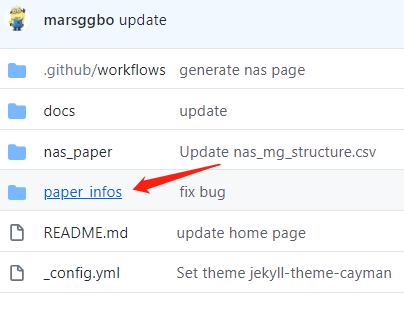
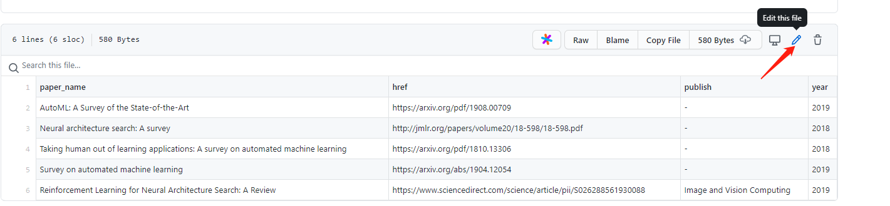
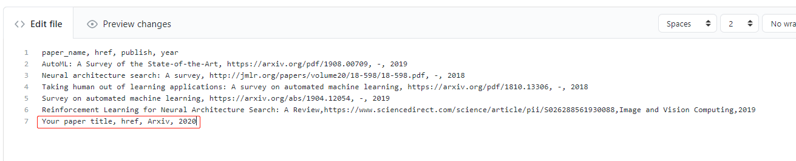
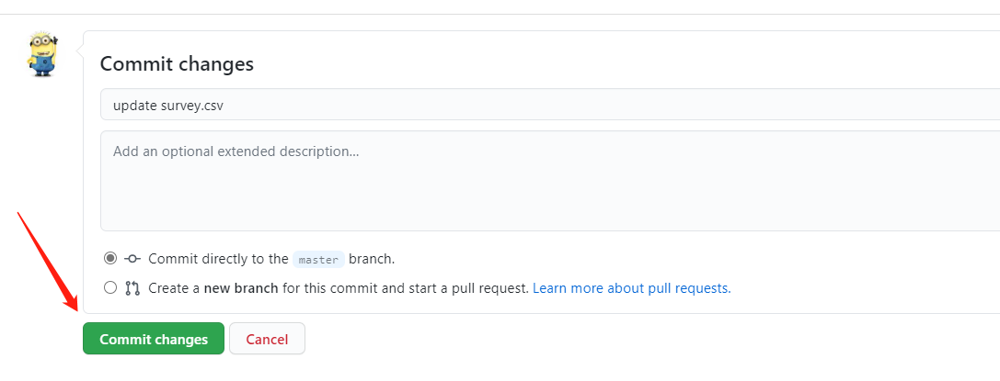

## Welcome AutoML

> Paper: [AutoML: A Survey of State-of-the-Art](https://arxiv.org/pdf/1908.00709)
> 
> Enter [Web page](https://marsggbo.github.io/automl_a_survey_of_state_of_the_art/)

# Upload your paper

Suppose your paper is also a AutoML-related survey, then you can simply upload your paper with the following steps on the Github.

- click `paper_infos` directory

- click a csv file related to your paper

- click `Edit this file`

- add your paper information

- commit changes

